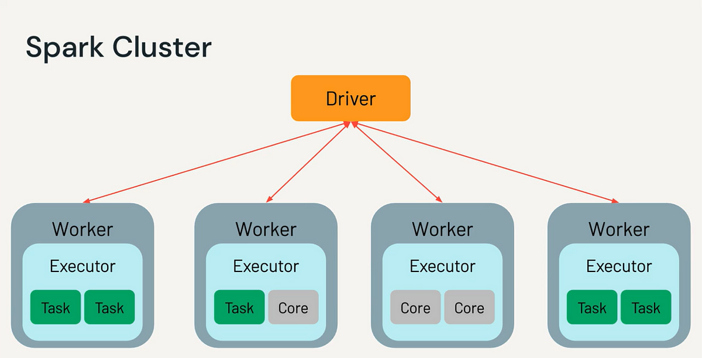

# Chapter - 0: Apache Spark Architecture

Apache Spark's architecture is built around the concept of distributed computing, allowing it to handle big data by dividing the workload across a cluster of machines. To understand Spark's architecture, you need to understand its core components: the **driver**, **workers**, and how they interact within a **cluster** environment. Let’s dive into these concepts and how Spark's architecture operates.

### Key Components of Spark Architecture

1. **Driver Program** (Driver):

   - The **driver** is the central coordinator of a Spark application. It’s where the main logic of the application is defined, and it runs on the **master node** of a cluster (or locally in standalone mode).
   - The driver is responsible for:
     - **Scheduling tasks**: It divides the operations (transformations and actions) into smaller tasks and sends them to the workers.
     - **Maintaining information** about the execution, including tracking the status of tasks and monitoring job progress.
     - **Collecting results**: It aggregates results once all tasks are completed.
     - **Managing shared variables** like broadcast variables and accumulators.
   - The driver converts high-level Spark operations (like transformations on RDDs or DataFrames) into a directed acyclic graph (DAG), which is then broken down into tasks.

2. **Workers** (Executor Nodes):

   - Workers are machines in the cluster that perform the actual computations assigned by the driver. Each worker runs **executors**, which are processes responsible for:
     - **Executing tasks**: A task is a unit of work, typically involving a transformation (e.g., `map`, `filter`) or an action (e.g., `reduce`, `collect`) on an RDD or DataFrame.
     - **Storing data**: Executors can cache intermediate data in memory or on disk to speed up future operations.
     - **Reporting task status** to the driver: Workers inform the driver about the completion or failure of their tasks.

3. **Cluster Manager**:
   - The **cluster manager** allocates resources across the cluster. Spark supports various types of cluster managers, including:
     - **Standalone**: A simple built-in Spark cluster manager.
     - **Apache Hadoop YARN**: A resource manager for Hadoop clusters.
     - **Apache Mesos**: A general-purpose cluster manager.
     - **Kubernetes**: A container orchestration system.
   - The cluster manager’s job is to provide worker nodes to run Spark executors, making sure there’s enough CPU, memory, and resources for tasks to execute.



### Spark Architecture in Action

Let’s understand how these components work together by walking through an example of a Spark application.

#### Example Scenario: Word Count Application

Suppose we want to count the number of occurrences of each word in a large text file distributed across multiple worker nodes.

1. **Driver Initialization**:

   - You, as the user, write a Spark application in Scala, Python, or Java and submit it to a Spark cluster.
   - The driver starts running on the master node. It reads the text file (input data) and defines a series of transformations to apply to the data (e.g., splitting the text into words and mapping each word to a count of `1`).

2. **Dividing Work into Tasks**:

   - The driver divides the input data (the large text file) into smaller chunks, called **partitions**. Each partition will be processed in parallel on different workers.
   - The driver converts your high-level operations (e.g., `map`, `reduceByKey`) into a **DAG (Directed Acyclic Graph)** of tasks that can be executed in stages. These stages are divided into tasks and sent to the worker nodes.

3. **Workers Execute Tasks**:

   - Each worker node receives one or more tasks from the driver, based on the partitioning of the data. For example:
     - Worker 1 might process the first chunk of the text file, splitting the lines into words and counting occurrences of each word.
     - Worker 2 might process the second chunk, performing the same operation.
     - And so on for all the workers.
   - These tasks are run in parallel on the different workers.

4. **Intermediate Results (Shuffle)**:

   - When the workers finish processing their chunks of data, they may need to **shuffle** the data. This happens when the results of one stage depend on operations from other stages (e.g., grouping by key, like words in our word count example).
   - The shuffled data is sent between workers over the network to group the words and their counts.

5. **Driver Collects Results**:
   - After all tasks complete, the final results (i.e., word counts) are sent back to the driver.
   - The driver can either aggregate these results or send them back to the user (e.g., via the console).

### Example Code for Word Count:

```scala
// Spark Session initialization (in local mode or a cluster)
val spark = SparkSession.builder.appName("WordCount").getOrCreate()

// Load text file into an RDD
val textFile = spark.sparkContext.textFile("hdfs://path/to/largefile.txt")

// Split the text into words, map each word to a count of 1, and reduce by key to count occurrences
val wordCounts = textFile.flatMap(line => line.split(" "))
                         .map(word => (word, 1))
                         .reduceByKey(_ + _)

// Collect and print the result
wordCounts.collect().foreach(println)
```

### Breakdown of Key Architectural Components in This Example:

1. **Driver**:
   - The driver program (`SparkSession.builder.appName("WordCount")`) reads the input file from HDFS, defines the operations (`flatMap`, `map`, `reduceByKey`), and coordinates the execution.
2. **Workers**:

   - Workers execute the tasks defined by the driver. Each worker processes a portion of the text file and performs the map and reduce operations on its partition of the data.

3. **Cluster Manager**:

   - The cluster manager allocates worker nodes to the application and ensures that there are enough resources (CPU, memory) for each task.

4. **Tasks**:
   - The Spark job is divided into tasks based on data partitions. For example, one task might handle all words in the first partition of the text file, another task might handle words in the second partition, and so on.

### Spark Execution Flow:

1. **Job Submission**: The user submits a Spark job (like the word count example).
2. **DAG Creation**: The driver creates a DAG of stages based on the job.
3. **Task Scheduling**: The DAG is divided into tasks, and the cluster manager schedules these tasks across the available worker nodes.
4. **Task Execution**: Workers execute the tasks, perform transformations on the data, and shuffle data if necessary.
5. **Result Collection**: Once the tasks are complete, the driver collects the results and returns them to the user.

### Diagram of Spark Architecture

Here’s a simple conceptual representation of Spark’s architecture:

```
+---------------------------+
|      Driver Program        |  <-- Submits the job, creates DAG, schedules tasks
+---------------------------+
            |
            |     Sends tasks to workers
            V
+----------------------------+     +-----------------------------+
|  Worker Node 1              |     |  Worker Node 2               |
| +------------------------+  |     | +-------------------------+ |
| | Executor                |  |     | | Executor                 | |
| | +--------------------+  |  |     | | +---------------------+ | |
| | | Task 1 (Process Part)|  |  |     | | | Task 2 (Process Part) | | |
| | +--------------------+  |  |     | | +---------------------+ | |
| +------------------------+  |     | +-------------------------+ |
+----------------------------+     +-----------------------------+
                  |                           |
                  |                           |
         Data shuffling (if needed)     Data shuffling (if needed)
                  |                           |
+-----------------------------+  +-----------------------------+
|  Worker Node 3               |  |  Worker Node 4               |
| +-------------------------+  |  | +-------------------------+ |
| | Executor                 |  |  | | Executor                 | |
| | +---------------------+  |  |  | | +---------------------+ | |
| | | Task 3 (Process Part) |  |  |  | | Task 4 (Process Part) |  | |
| +-------------------------+  |  | +-------------------------+ |
+-----------------------------+  +-----------------------------+
```

### Conclusion:

Spark’s architecture, consisting of the driver, workers, and cluster manager, enables efficient distributed processing of large datasets. The **driver** coordinates the computation, while **workers** execute tasks in parallel, and the **cluster manager** ensures optimal use of resources. This architecture allows Spark to scale efficiently and perform well in big data environments.
