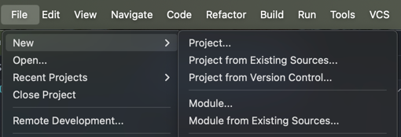
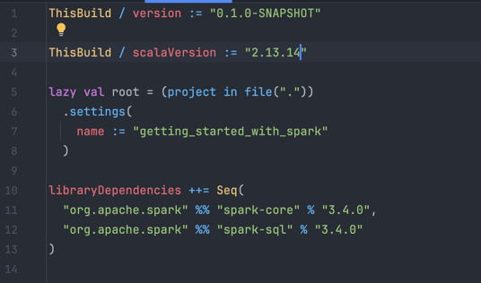

# Getting Started with Scala and Spark

## Chapter 1: Installation and Setup

**Preferred IDE** - IntelliJ IDEA Community Edition

Step 0: Pre Installation Steps

### **Install Java Development Kit (JDK)**

Spark and Scala require JDK 8 or 11. Download and install the appropriate version of the JDK:

- [Oracle JDK](https://www.oracle.com/java/technologies/javase-downloads.html)
- [AdoptOpenJDK](https://adoptopenjdk.net/)

Set the `JAVA_HOME` environment variable properly.

### **Install Apache Spark**

You need to download and install Apache Spark for your local development environment:

1. Download Spark from the [Apache Spark website](https://spark.apache.org/downloads.html).
2. Choose the pre-built package for Hadoop (e.g., Spark 3.x with Hadoop 3.x).
3. Extract the Spark folder and add the `bin` directory of Spark to your `PATH` environment variable.
4. To verify, open a terminal and type:

   ```bash
   spark-shell
   ```

This should start the Spark shell if everything is installed correctly.

### **Install SBT (Scala Build Tool)**

SBT is used to build and manage dependencies in your Scala project:

1. Download and install SBT from the [official SBT website](https://www.scala-sbt.org/download.html).
2. Verify the installation by running:

```bash
   sbt sbtVersion
```

Step 1: Set up the boilerplate. If you have Intellij installed you can directly create it like this or you can run the following from cli: `sbt new scala/scala-seed.g8`.

Step 2: Make sure your scala version is `2.13.x`. (Less than 3.0)


Step 3: Go to [build.sbt](../../build.sbt) and add the following dependencies:

```scala
libraryDependencies ++= Seq(
  "org.apache.spark" %% "spark-core" % "3.4.0",
  "org.apache.spark" %% "spark-sql" % "3.4.0"
)
```

After adding the dependencies would look like this:




Step 4: Setup some sample assets in assets folder:

content of [BillSplit.md](../assets/BillSplit.md):
```
Breakfast - Yatin - 200, Vaibhav - 400, Shivam - 300
Lunch - Yatin - 600, Vaibhav - 200, Shivam - 400
Dinner - Yatin - 40, Vaibhav - 60, Shivam - 50
```
content of [example.json](../assets/example.json):

```json
[{"name":"shivam"},{"name":"kanchan"},{"name":"saurabh"}]
```

content of [sample.txt](../assets/sample.txt):

```
Start from here
This is a README file containing all the details about how to get started with Apache Spark. This will help me land my first dream job and get really good at Spark.
This tutorial strictly follows Spark 3.0.0 and Scala 2.12.10. If you are using a different version, please refer to the official documentation.
```
```
For basics of spark:
```scala
val df = spark.createDataFrame(Seq(
  ("John", 28, 5000),
  ("Alice", 34, 6000),
  ("Bob", 45, 8000),
  ("Catherine", 23, 3000),
  ("Derek", 32, 4000)
)).toDF("name", "age", "salary")
```

Step 5: Create a `log4j.properties` file in your project's `src/main/resources` folder. If you don't already have a resources folder, create it manually. Here's log content:
```
# Set root logger level to ERROR
log4j.rootCategory=ERROR, console

# Silence INFO, WARN, and DEBUG logs for Spark, Hadoop, and other components
log4j.logger.org.apache.spark=ERROR
log4j.logger.org.apache.hadoop=ERROR
log4j.logger.org.spark-project=ERROR
log4j.logger.org.spark-project.jetty=ERROR
log4j.logger.org.apache.spark.repl.SparkILoop$SparkILoopInterpreter=ERROR

# Console output configuration
log4j.appender.console=org.apache.log4j.ConsoleAppender
log4j.appender.console.target=System.err
log4j.appender.console.layout=org.apache.log4j.PatternLayout
log4j.appender.console.layout.ConversionPattern=%d{yy/MM/dd HH:mm:ss} %p %c{1}: %m%n

```

Step 6: After updating again update `build.sbt` to:

```
ThisBuild / version := "0.1.0-SNAPSHOT"

ThisBuild / scalaVersion := "2.13.14"

lazy val root = (project in file("."))
  .settings(
    name := "getting_started_with_spark",
    libraryDependencies ++= Seq(
      "org.apache.spark" %% "spark-core" % "3.5.1",
      "org.apache.spark" %% "spark-sql" % "3.5.1"
    ),

    dependencyOverrides += "org.scala-lang" % "scala-library" % scalaVersion.value,

    fork := true,

    javaOptions += "-Dlog4j.configuration=file:./src/main/scala/resources/log4j.properties"
  )

```

